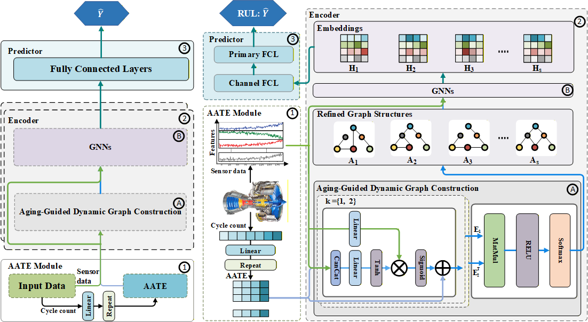

<style>
.score-row {
  color: blue;
}
</style>
# Aging-Informed Dynamic Graph Networks for Aero-Engine RUL Estimation

**AIDGN-RUL** (Aging-Informed Dynamic Graph Networks for RUL estimation), is a deep learning framework that formulates RUL prediction as an **aging-informed dynamic graph learning problem**. The model integrates degradation priors with evolving inter-sensor dependencies using temporal embeddings and graph neural networks, enabling accurate and robust remaining useful life prediction for aero-engine systems.

For full methodological details, please refer to the paper:

📄 **Paper:** [Link to paper]


<br>
<em>Figure 1: Overview of the AIDGN-RUL framework.</em>

---

# Experimental Results

AIDGN-RUL is evaluated against multiple state-of-the-art RUL prediction methods, including Dual-Mixer-RUL, DA-Transformer-RUL, FCSTGNN-RUL, and other competitive baselines. Across both benchmark datasets, the proposed model achieves **superior predictive accuracy and strong robustness**.

---

## Performance on C-MAPSS Dataset
<table>
  <thead>
    <tr>
      <th rowspan="2">Model</th>
      <th colspan="4">RMSE</th>
      <th colspan="4">Score</th>
    </tr>
    <tr>
      <th>FD001</th><th>FD002</th><th>FD003</th><th>FD004</th>
      <th>FD001</th><th>FD002</th><th>FD003</th><th>FD004</th>
    </tr>
  </thead>
  <tbody>
    <tr>
      <td>LeNet</td>
      <td>14.12 ± 1.24</td><td>13.25 ± 1.98</td><td>11.98 ± 0.95</td><td>14.98 ± 1.31</td>
      <td>371.25 ± 31.31</td><td>765.59 ± 43.53</td><td>244.26 ± 41.64</td><td>1258.33 ± 53.27</td>
    </tr>
    <tr>
      <td>AGCNN</td>
      <td>12.86 ± 1.29</td><td>15.36 ± 2.12</td><td>11.87 ± 0.38</td><td>18.46 ± 3.85</td>
      <td>258.59 ± 46.73</td><td>1142.80 ± 78.65</td><td>241.97 ± 27.77</td><td>1609.08 ± 275.99</td>
    </tr>
    <tr>
      <td>LSTM</td>
      <td>13.94 ± 0.99</td><td>12.99 ± 1.02</td><td>12.09 ± 1.02</td><td>13.98 ± 0.45</td>
      <td>390.63 ± 16.48</td><td>748.88 ± 25.34</td><td>328.32 ± 30.53</td><td><u>861.90 ± 39.34</u></td>
    </tr>
    <tr>
      <td>Transformer</td>
      <td>14.72 ± 1.83</td><td>16.01 ± 3.14</td><td>13.06 ± 2.36</td><td>18.10 ± 2.50</td>
      <td>345.99 ± 38.46</td><td>1264.97 ± 204.48</td><td>321.40 ± 60.91</td><td>1834.81 ± 319.42</td>
    </tr>
    <tr>
      <td>AutoFormer</td>
      <td>13.24 ± 1.24</td><td>15.23 ± 4.06</td><td>13.19 ± 1.40</td><td>18.18 ± 3.31</td>
      <td>313.54 ± 83.22</td><td>1403.52 ± 343.47</td><td>324.78 ± 59.14</td><td>2703.56 ± 340.59</td>
    </tr>
    <tr>
      <td>PatchTST</td>
      <td>18.11 ± 1.50</td><td>17.62 ± 2.31</td><td>15.64 ± 1.03</td><td>18.17 ± 2.07</td>
      <td>474.75 ± 39.44</td><td>1298.71 ± 241.35</td><td>498.17 ± 40.08</td><td>1701.38 ± 64.39</td>
    </tr>
    <tr>
      <td>DA-Transformer</td>
      <td>15.48 ± 1.04</td><td>14.76 ± 2.12</td><td>14.17 ± 1.64</td><td>17.14 ± 1.33</td>
      <td>401.17 ± 35.23</td><td>1102.97 ± 107.88</td><td>503.53 ± 53.12</td><td>1891.90 ± 297.65</td>
    </tr>
    <tr>
      <td>PINN</td>
      <td>15.31 ± 4.02</td><td>16.75 ± 4.96</td><td>17.51 ± 4.17</td><td>20.41 ± 5.54</td>
      <td>495.01 ± 86.04</td><td>1556.71 ± 287.78</td><td>918.00 ± 186.07</td><td>1996.35 ± 512.12</td>
    </tr>
    <tr>
      <td>Dual-Mixer</td>
      <td>13.14 ± 0.91</td><td>13.72 ± 1.54</td><td>12.37 ± 1.57</td><td>14.83 ± 2.36</td>
      <td>261.78 ± 26.35</td><td>779.77 ± 68.72</td><td>295.52 ± 30.09</td><td>1082.36 ± 105.67</td>
    </tr>
    <tr>
      <td>SDAGCNN</td>
      <td>15.03 ± 2.02</td><td>14.02 ± 4.10</td><td>15.89 ± 2.31</td><td>15.97 ± 4.15</td>
      <td>423.56 ± 36.04</td><td>1136.53 ± 212.78</td><td>459.16 ± 86.07</td><td>1046.02 ± 303.43</td>
    </tr>
    <tr>
      <td>CDSG</td>
      <td>12.31 ± 1.05</td><td><u>12.99 ± 3.06</u></td><td>12.67 ± 1.35</td><td><u>13.48 ± 2.19</u></td>
      <td>249.78 ± 21.00</td><td><u>1074.49 ± 98.61</u></td><td>388.06 ± 49.63</td><td>1203.43 ± 189.34</td>
    </tr>
    <tr>
      <td>FCSTGNN</td>
      <td><u>11.95 ± 1.22</u></td><td>13.03 ± 1.15</td><td><u>11.65 ± 2.04</u></td><td>14.33 ± 2.03</td>
      <td><u>274.27 ± 42.45</u></td><td>795.40 ± 95.15</td><td><u>251.48 ± 45.96</u></td><td>898.36 ± 297.16</td>
    </tr>
    <tr>
      <td><b>Proposed AIDGN</b></td>
      <td><b>11.46 ± 0.83</b></td><td><b>12.63 ± 1.46</b></td><td><b>10.52 ± 1.27</b></td><td><b>13.03 ± 1.98</b></td>
      <td><b>248.49 ± 18.31</b></td><td><b>663.80 ± 48.36</b></td><td><b>202.87 ± 22.05</b></td><td><b>762.25 ± 62.64</b></td>
    </tr>
  </tbody>
</table>

---

## Performance on N-CMAPSS Dataset

<table>
  <thead>
    <tr>
      <th rowspan="2">Model</th>
      <th rowspan="2">Metric</th>
      <th colspan="8">Datasets</th>
    </tr>
    <tr>
      <th>DS01</th><th>DS02</th><th>DS03</th><th>DS04</th>
      <th>DS05</th><th>DS06</th><th>DS07</th><th>Avg</th>
    </tr>
  </thead>
  <tbody>
    <tr>
      <td rowspan="2">LeNet</td>
      <td>RMSE</td>
      <td>8.28 ± 1.06</td><td>7.29 ± 0.38</td><td>7.73 ± 0.16</td><td>13.69 ± 0.76</td>
      <td>9.02 ± 0.21</td><td>8.13 ± 0.11</td><td><u>11.15 ± 0.91</u></td><td>9.33 ± 0.51</td>
    </tr>
    <tr class="score-row">
      <td>Score</td>
      <td>1.34 ± 1.47</td><td>0.96 ± 0.24</td><td><u>0.80 ± 0.15</u></td><td>2.89 ± 0.43</td>
      <td>0.99 ± 0.12</td><td>0.86 ± 0.03</td><td><u>1.33 ± 0.37</u></td><td>1.31 ± 0.40</td>
    </tr>
    <tr>
      <td rowspan="2">AGCNN</td>
      <td>RMSE</td>
      <td>8.02 ± 1.61</td><td><u>6.31 ± 0.71</u></td><td>7.94 ± 0.36</td><td>13.57 ± 0.70</td>
      <td>8.53 ± 0.41</td><td>8.62 ± 0.27</td><td>11.81 ± 0.51</td><td>9.31 ± 0.46</td>
    </tr>
    <tr class="score-row">
      <td>Score</td>
      <td>1.07 ± 0.09</td><td><b>0.74 ± 0.35</b></td><td>0.91 ± 0.57</td><td>2.95 ± 0.28</td>
      <td>0.96 ± 0.06</td><td>0.97 ± 0.05</td><td>1.45 ± 0.19</td><td>1.31 ± 0.23</td>
    </tr>
    <tr>
      <td rowspan="2">LSTM</td>
      <td>RMSE</td>
      <td>7.91 ± 1.02</td><td><b>6.25 ± 0.65</b></td><td>7.82 ± 0.13</td><td><u>11.86 ± 0.28</u></td>
      <td>8.21 ± 0.51</td><td><u>7.77 ± 0.13</u></td><td>11.93 ± 1.01</td><td><u>8.85 ± 0.39</u></td>
    </tr>
    <tr class="score-row">
      <td>Score</td>
      <td>1.04 ± 1.01</td><td><b>0.74 ± 0.01</b></td><td><u>0.80 ± 0.05</u></td><td>3.57 ± 0.35</td>
      <td>0.83 ± 0.39</td><td><u>0.78 ± 0.02</u></td><td>1.47 ± 0.23</td><td>1.32 ± 0.29</td>
    </tr>
    <tr>
      <td rowspan="2">Transformer</td>
      <td>RMSE</td>
      <td>13.20 ± 5.67</td><td>11.53 ± 2.18</td><td>14.51 ± 1.86</td><td>23.19 ± 2.25</td>
      <td>13.78 ± 3.12</td><td>15.37 ± 2.79</td><td>14.35 ± 3.33</td><td>15.13 ± 2.89</td>
    </tr>
    <tr  class="score-row">
      <td>Score</td>
      <td>7.66 ± 3.97</td><td>2.99 ± 1.61</td><td>4.07 ± 2.48</td><td>19.71 ± 3.78</td>
      <td>4.03 ± 1.18</td><td>4.82 ± 2.41</td><td>2.74 ± 1.73</td><td>6.57 ± 2.45</td>
    </tr>
    <tr>
      <td rowspan="2">AutoFormer</td>
      <td>RMSE</td>
      <td>15.83 ± 1.24</td><td>13.37 ± 1.58</td><td>19.78 ± 4.17</td><td>24.15 ± 1.35</td>
      <td>23.89 ± 4.21</td><td>21.55 ± 1.96</td><td>19.15 ± 1.16</td><td>19.67 ± 2.24</td>
    </tr>
    <tr  class="score-row">
      <td>Score</td>
      <td>4.20 ± 1.23</td><td>2.93 ± 0.42</td><td>6.53 ± 3.61</td><td>10.24 ± 1.63</td>
      <td>13.80 ± 1.63</td><td>7.92 ± 0.97</td><td>6.89 ± 1.36</td><td>7.50 ± 1.55</td>
    </tr>
    <tr>
      <td rowspan="2">PatchTST</td>
      <td>RMSE</td>
      <td>20.20 ± 1.89</td><td>19.96 ± 1.85</td><td>20.85 ± 1.03</td><td>24.48 ± 2.03</td>
      <td>23.26 ± 1.98</td><td>24.84 ± 1.88</td><td>24.68 ± 1.25</td><td>22.61 ± 0.00</td>
    </tr>
    <tr  class="score-row">
      <td>Score</td>
      <td>29.84 ± 0.62</td><td>7.57 ± 0.77</td><td>6.80 ± 0.09</td><td>11.60 ± 1.26</td>
      <td>9.41 ± 0.26</td><td>14.62 ± 0.63</td><td>9.97 ± 0.41</td><td>12.83 ± 0.58</td>
    </tr>
    <!-- DA-Transformer -->
<tr>
  <td rowspan="2">DA-Transformer</td>
  <td>RMSE</td>
  <td>19.95 ± 2.22</td><td>17.08 ± 2.82</td><td>15.97 ± 2.36</td><td>24.37 ± 5.08</td>
  <td>20.85 ± 4.21</td><td>14.17 ± 4.45</td><td>13.47 ± 2.79</td><td>17.98 ± 3.42</td>
</tr>
<tr class="score-row">
  <td>Score</td>
  <td>13.18 ± 8.62</td><td>9.15 ± 4.67</td><td>5.71 ± 4.32</td><td>15.39 ± 3.90</td>
  <td>9.78 ± 2.09</td><td>4.57 ± 2.74</td><td>3.12 ± 3.37</td><td>8.70 ± 3.82</td>
</tr>

<!-- PINN -->
<tr>
  <td rowspan="2">PINN</td>
  <td>RMSE</td>
  <td>24.42 ± 0.78</td><td>19.35 ± 2.57</td><td>21.21 ± 3.35</td><td>18.69 ± 0.53</td>
  <td>23.24 ± 0.25</td><td>23.67 ± 6.44</td><td>25.51 ± 2.30</td><td>22.30 ± 2.32</td>
</tr>
<tr class="score-row">
  <td>Score</td>
  <td>12.20 ± 4.20</td><td>9.64 ± 3.67</td><td>7.03 ± 3.43</td><td>12.41 ± 0.03</td>
  <td>8.83 ± 0.14</td><td>8.66 ± 4.28</td><td>10.07 ± 4.02</td><td>9.83 ± 2.82</td>
</tr>

<!-- Dual-Mixer -->
<tr>
  <td rowspan="2">Dual-Mixer</td>
  <td>RMSE</td>
  <td><u>7.34 ± 0.21</u></td><td>6.98 ± 0.49</td><td><u>7.44 ± 0.03</u></td><td>12.09 ± 0.96</td>
  <td><u>7.52 ± 0.06</u></td><td>8.47 ± 0.07</td><td>12.13 ± 0.21</td><td><u>8.85 ± 0.29</u></td>
</tr>
<tr class="score-row">
  <td>Score</td>
  <td><u>0.89 ± 0.01</u></td><td>0.89 ± 0.33</td><td>0.81 ± 0.43</td><td><u>2.60 ± 0.41</u></td>
  <td><b>0.72 ± 0.03</b></td><td>0.83 ± 0.02</td><td>1.51 ± 0.23</td><td><u>1.18 ± 0.21</u></td>
</tr>

<!-- SDAGCN -->
<tr>
  <td rowspan="2">SDAGCN</td>
  <td>RMSE</td>
  <td>11.90 ± 0.25</td><td>11.12 ± 1.30</td><td>11.64 ± 0.54</td><td>19.16 ± 0.53</td>
  <td>14.32 ± 0.25</td><td>17.81 ± 6.44</td><td>16.27 ± 2.30</td><td>14.60 ± 1.66</td>
</tr>
<tr class="score-row">
  <td>Score</td>
  <td>2.94 ± 0.03</td><td>1.76 ± 0.97</td><td>1.74 ± 0.23</td><td>7.73 ± 0.03</td>
  <td>3.07 ± 0.64</td><td>5.05 ± 4.28</td><td>5.22 ± 4.02</td><td>3.93 ± 1.46</td>
</tr>

<!-- CDSG -->
<tr>
  <td rowspan="2">CDSG</td>
  <td>RMSE</td>
  <td>8.81 ± 0.10</td><td>7.69 ± 0.73</td><td>8.27 ± 0.14</td><td>18.54 ± 0.98</td>
  <td>11.92 ± 0.44</td><td>10.76 ± 0.13</td><td>12.50 ± 0.35</td><td>11.21 ± 0.41</td>
</tr>
<tr class="score-row">
  <td>Score</td>
  <td>1.41 ± 0.03</td><td>1.15 ± 0.41</td><td>0.94 ± 0.11</td><td>4.85 ± 0.57</td>
  <td>1.17 ± 0.73</td><td>1.38 ± 0.02</td><td>1.65 ± 0.21</td><td>1.79 ± 0.30</td>
</tr>

<!-- FCSTGNN -->
<tr>
  <td rowspan="2">FCSTGNN</td>
  <td>RMSE</td>
  <td>10.52 ± 1.32</td><td>7.02 ± 0.67</td><td>9.54 ± 0.48</td><td>15.68 ± 1.27</td>
  <td>11.78 ± 0.90</td><td>10.47 ± 0.23</td><td>12.73 ± 1.02</td><td>11.10 ± 0.84</td>
</tr>
<tr class="score-row">
  <td>Score</td>
  <td>1.58 ± 0.92</td><td><u>1.03 ± 0.17</u></td><td>1.16 ± 0.21</td><td>3.73 ± 0.09</td>
  <td>1.76 ± 0.43</td><td>1.38 ± 0.34</td><td>1.73 ± 0.55</td><td>1.77 ± 0.39</td>
</tr>
    <tr>
      <td rowspan="2">Proposed AIDGN</td>
      <td>RMSE</td>
      <td><b>5.51 ± 0.89</b></td><td>7.63 ± 1.03</td><td><b>7.05 ± 0.17</b></td><td><b>8.31 ± 0.02</b></td>
      <td><b>7.18 ± 0.47</b></td><td><b>5.70 ± 0.16</b></td><td><b>10.71 ± 0.46</b></td><td><b>7.44 ± 0.46</b></td>
    </tr>
    <tr>
      <td>Score</td>
      <td><b>0.61 ± 0.37</b></td><td><u>1.03 ± 0.63</u></td><td><b>0.77 ± 0.02</b></td><td><b>0.98 ± 0.01</b></td>
      <td><u>0.81 ± 0.08</u></td><td><b>0.57 ± 0.03</b></td><td><b>1.18 ± 0.13</b></td><td><b>0.85 ± 0.18</b></td>
    </tr>

  </tbody>
</table>
---

# Datasets

Experiments are conducted on two widely used NASA prognostics datasets.

## C-MAPSS Dataset

Official download:  
https://www.nasa.gov/intelligent-systems-division/discovery-and-systems-health/pcoe/pcoe-data-set-repository/

## N-CMAPSS Dataset

Official download:  
https://ti.arc.nasa.gov/tech/dash/groups/pcoe/prognostic-data-repository/

If the official links are inaccessible, a backup dataset mirror is available:

https://drive.google.com/drive/folders/1HtnDBGhMoAe53hl3t1XeCO9Z8IKd3-Q-

---

# Dataset Setup

1. Download the required dataset(s)
2. Place the dataset folder inside the project root directory
3. Ensure the directory structure matches the expected format used by the training scripts
4. Update dataset paths in configuration files if needed

---

# Environment Requirements

The implementation has been tested with the following environment:

- Python 3.8.19  
- NumPy 1.24.4  
- pandas 1.5.3  
- scikit-learn 0.24.0  
- PyTorch 1.8.2 + cu102  
- CUDA 10.2 (recommended for GPU acceleration)

Install dependencies using:

```bash
pip install -r requirements.txt
```

---

# Usage

## Evaluate with Pre-trained Models

Evaluate on **C-MAPSS**:

```bash
python CMAPSS_test.py
```

Evaluate on **N-CMAPSS**:

```bash
python N_CMAPSS_test.py
```

---

## Train the Model from Scratch

Train on **C-MAPSS FD001 and FD003**:

```bash
python CMAPSS1_3_train.py
```

Train on **N-CMAPSS**:

```bash
python N_CMAPSS_train.py
```

[//]: # (---)

[//]: # ()
[//]: # ()
[//]: # (# Citation)

[//]: # ()
[//]: # ()
[//]: # (If you find this repository useful in your research, please cite:)

[//]: # ()
[//]: # ()
[//]: # (```bibtex)

[//]: # ()
[//]: # (@article{AIGCN_RUL,)

[//]: # ()
[//]: # (  title={Aging-Informed Graph Convolutional Networks for Aero-Engine Health Prognosis},)

[//]: # ()
[//]: # (  author={Your Name},)

[//]: # ()
[//]: # (  journal={IEEE transactions on informatics},)

[//]: # ()
[//]: # (  year={2026})

[//]: # ()
[//]: # (})

[//]: # ()
[//]: # (```)

---

# Acknowledgements

We sincerely acknowledge the following open-source repositories:

- FCSTGNN  
  https://github.com/Frank-Wang-oss/FCSTGNN

- Dual-Mixer-RUL  
  https://github.com/fuen1590/PhmDeepLearningProjects

Their work has contributed significantly to research in **prognostics and health management (PHM)** and **dynamic graph construction**.

---

# Contact

For questions or collaboration inquiries, please open an issue in this repository or contact:

[//]: # (**@mcmaster.ca**)

---

# License

Please specify your preferred license (e.g., MIT, Apache 2.0, GPL).